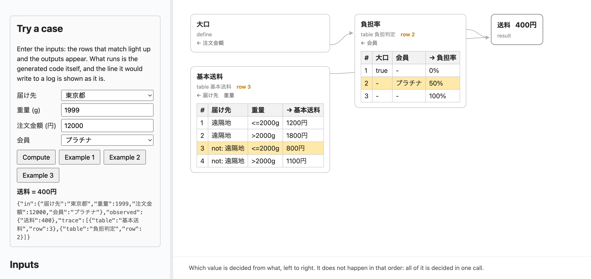
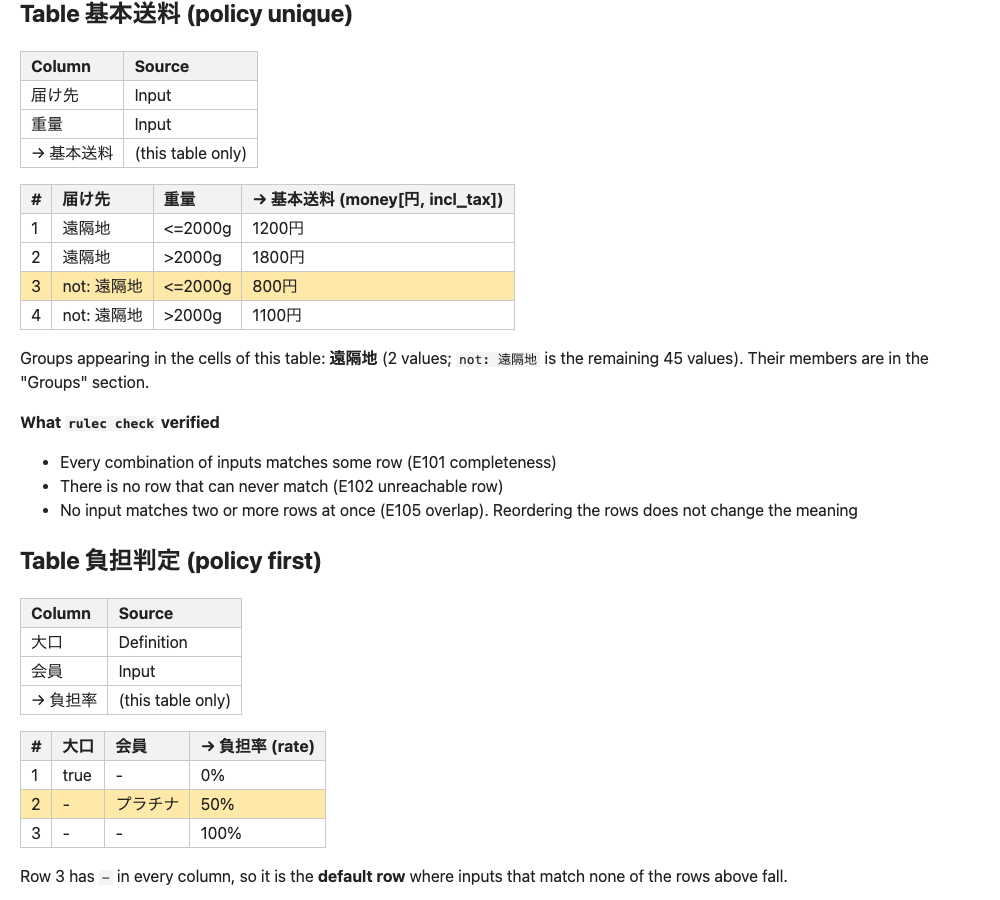

# What it proves

`rulec check` is the centre of the tool. Everything else — the code
generation, the vectors, the replay — is downstream of it, and a rule
that does not pass it does not generate.

```console
$ rulec check rules/
note rules/ゆうパック運賃.rule: 21 shadow pairs (21 structural, 0 equivalent, 0 needs review)
ok rules/ゆうパック運賃.rule
```

Exit codes are **0** (notes only), **1** (errors), **2** (bad arguments
or an unreadable file). Read the exit code, not whether the output looks
empty.

## The seven

| | |
|---|---|
| **Completeness** | if some input matches no row, it stops — **with that input** |
| **Overlap** | under `policy unique`, an overlap is an error. Under `policy first`, structural shadowing (the staircase) is told apart from the pairs whose outputs differ and therefore deserve a decision |
| **Dead rows** | a row nothing reaches. The message tells apart "earlier rows already cover it" from "the upstream table never emits the value it names" |
| **Units** | adding yen to grams stops. So does tax-inclusive plus tax-exclusive |
| **Rounding** | a numeric output must declare one. Without it, the message shows the money: "down(1円) gives 701, half_up(1円) gives 702, up(10円) gives 710 — the mode moves it by up to 9 yen" |
| **Overflow** | that every intermediate fits in int64, proved from the declared ranges and steps |
| **Examples** | every example runs; a failure names the rows that fired; a missing output column stops |

A `constraint` narrows what completeness quantifies over: no row is demanded for a
combination declared not to happen, and the generated code refuses one at the door
instead. In a rule that walks a sequence, the same completeness check asks whether
**every verdict the table can produce has an arm** in the fold (E024).

In a rule that binds an enum to a `.proto` with `import proto`,
completeness reaches **across the contract**. Every `rulec check` reads
that file: a set that no longer agrees is E032, and once the sets agree,
a value that no row names and no `default` marks is E033. Adding a value
to an enum is a compatible change on the wire, so the tools that guard
the contract let it through — this is the check that stops it from
passing quietly through a table with a `-` row.

A rule that declares its documents with `source` and cites them with `@source fragment` is
held to its copies: every cited fragment has a copy beside the rule and its digest pinned in
the rule. No pin is E037, a pin that differs from the copy is E038 (naming the tables, clauses
and rows that cite it), a missing copy is E039, a pin no citation uses is W119. `check` never
reads the network: `rulec source fetch` brings the copies, `rulec source pin` writes the pins,
and, for a statute, `rulec source outdated` asks e-Gov, the Japanese government's statute
database, whether a later amendment changes the text of a cited fragment.

**What is cited from a document is a table.** For a tariff sheet or a company rule, `@source
表1` takes that table out of the document, writes it beside it, and holds the rule to that copy
ever after (a sheet in a workbook, a table in a Word file, what it looks like in Markdown and
CSV; for a PDF or a scan, hand an extractor to `--via`). That is where **one more check** comes
in.

- **E116** — an amount a row writes is nowhere in the copy it cites. This is the error no
  check of the table alone can reach: `1100円` written as `1000円` sits on the rounding grid,
  leaves no gap and overlaps nothing.
- **W120** — a number the copy states as a whole cell is used by no row, which is what **a row
  that was never transcribed** looks like. Completeness cannot see it: the inputs of a dropped
  row fall into one of the rows that remain.

Only amounts are compared: a threshold is rewritten as it is transcribed (`1,949,000円まで`
becomes `<=1949000円`) and an amount is not. The approver's page quotes the copy under the
table and adds a line to what was verified: every amount in this table is a value the copy
shows.

A rule that applies another (`apply`, the way a statute applies one provision to another case
with its terms read differently) is held to the applied rule's digest (E040), has to substitute
every input of the applied rule (E041) with agreeing types (E042), and has to keep what it
passes inside the applied rule's ranges and constraints (E043, with a value outside them as the
example). A rule that cannot be applied — it applies a rule itself, walks a sequence, or fails
check — is E044. The applied rule's tables and clauses are expanded into the rule and checked
with it; the rows this rule never reaches stay silent, and only a whole table none of whose
rows is reached is W118.

A rule in which two or more tables define the same output — a main rule and the special case
that says `overrides` over it, a `clause` written as one line of prose among them — runs the
first three checks over **those tables as one set**.
Completeness is judged over their union. An overlap passes when a precedence is written and
stops as E105 when none is. A row the rows taking precedence cover entirely is E102, and an
`overrides` line whose rows meet none of its target's is W117. The approver's page says in one
sentence which table is the exception to which.

Every diagnostic writes its first line in the words of the business,
**always carries a concrete case**, and states the fix down to the
rewritten form.

## Proved is not type-checked

Type checking says a **value has the right shape**: a member of the enum, an integer, the unit
it claims. APIs and models that return typed values are common now, which makes the two easy to
run together. **A right shape says nothing about a right answer.**

What `rulec check` proves is not a shape but a **property of the table**: every input in the
declared range matches some row; no input matches two; every row can be reached; units never
mix; every intermediate fits in int64. Those five are shown exhaustively — not sampled.

**Why it can be exhaustive at all.** A cell only ever tests its own column (`<=2000g` is the
weight column, `遠隔地` the destination column), so a row is the product of its columns'
conditions — one box of the input space — and a numeric column only has to be cut where the
table itself cuts it. The declared range therefore falls into a **finite number of boxes**, and
looking at all of them terminates. The cell language is kept narrow to keep that true. Nothing
is waved through when it does not terminate either: over the budget, E109 stops.

Four things it does **not** prove, and they are kept beside the word:

1. **That the table matches reality.** What is proved is what can be said about the table *as
   written*. Cite the document a table was transcribed from (`@source 表1`) and an amount that
   disagrees with the copy does fail (E116, W120) — but even then what is shown is agreement
   with the copy, not with the world. With no citation, transcribe the tariff wrong and
   everything stays green
2. **That the generated code answers like the table.** That is a *test*: cases built from the
   boundaries run through the reference evaluator and every generated language, compared byte
   for byte. Strong evidence, not an equivalence proof
3. **The row pairs W114 could not settle.** Those move to a guard at run time — so "the rows
   do not overlap" is not always provable, and the pairs where it was not are always named
4. **That the checker itself is right.** The five above come out of rulec's own implementation,
   and that implementation has not been proved correct. The evidence is 80 deliberately broken
   rules (`tests/mutants/`) each producing the diagnostic it should, 28 rules transcribed from
   real published terms passing on every commit, and the reference evaluator agreeing with
   twelve languages. **Evidence, not proof**

For the Rust, a second tool reads what was generated: `gen` writes proof harnesses for
[Kani](https://model-checking.github.io/kani/), and over every input in the declared domain
they hold that no table falls through, that the guard of (3) never fires, that nothing
overflows an `i64`, and that the rows of each `unique` table cover the domain exactly once.
It shares no code with the checker above, so agreement is two unrelated tools saying the
same thing, and disagreement comes back with the input that shows it
([generate](generate.md#a-second-opinion-on-the-rust)).

**The evidence can be handed over, and the checks behind it are proved.** `rulec
certificate` writes out what the five proofs rest on — the tree that tiles the input space,
the axis each pair of rows of a `unique` table parts on, a point that reaches every row
with the values behind it, and the interval and the type of every computed value — together
with where each cell stands in your file, down to the byte, and what stands there. Two
programs re-check it: `tools/recheck.py`, one dependency-free file, and the program
`proofs/` builds, a Lean 4 development in which the meaning of a table, the checks, and the
theorems that each check settles its claim are all written down and machine-checked. That
moves what (4) asks you to take on trust from 42,000 lines of Rust to a few hundred lines
of checking whose soundness is proved — plus the reading of the document itself, which is
not. It does not remove (4): whether the tool *produces* a right certificate is still
evidence, the declared ranges and types and constraints in it are its own word, and five
things are named in a run rather than proved. Both programs end by saying which. See
[formats](formats.md) for the document, its limits, and both re-checkers.

## Reading a diagnostic

```
error[E101]: Completeness gap: some input matches no row
  --> rules/ゆうパック運賃.rule:34 table 運賃表
   |
34 | table 運賃表(fee_table)
   |       ^^^^^^ the input space is not fully covered
   |
 An input that matches no row: あて先 = 山梨県, サイズ = S60
 hint: add a row that matches this input.
 The shape of the row to add: `| 山梨県 | S60 | 820円 |`. Its output values are copied
 from the first row to give a shape that parses; they are not the right amounts. …
```

The witness is the part to reason about. `あて先 = 山梨県, サイズ = S60`
is not an illustration — it is an input the checker constructed, and it
is the sentence you hand to whoever knows the answer.

### `--terse`, when there are many

```console
$ rulec check rules/ --terse
error[E101]: Completeness gap: some input matches no row
  --> rules/ゆうパック運賃.rule:34 table 運賃表
  witness: あて先 = 山梨県, サイズ = S60
…
details: rulec explain <code>
```

Heading, position, witness. The pointer to the rest is printed once, at
the end of the run.

### `--format json`, when a program is reading

The same finding as data. The prose is still there, but nothing
downstream has to take a sentence apart:

```console
$ rulec check rules/ゆうパック運賃.rule --format json | jq -c 'select(.code=="E101") | {table:.where.table, witness:.witness.inputs, fix:.fix}'
{"table":"運賃表","witness":{"あて先":"山梨県","サイズ":"S60"},"fix":{"kind":"add_row","text":"| 山梨県 | S60 | 820円 |"}}
```

`where` says which table and row, `witness` is an assignment of values
in the canonical unit, `rows` names every row that takes part, and `fix`
carries the rewritten form ready to paste. **`witness` and `fix` do not
change with `--lang`** — only fields whose names say prose do. The full
shape is in [Formats](formats.md#check).

!!! warning "`fix.text` is a form, not a decision"

    It parses, and it removes the code — both are tested. It does not
    know the right amount, the right rounding direction or the right
    grid. Those are business decisions, and the caveat sits in `notes`,
    which is prose, because `fix.text` is bytes.

## Looking a code up

Every code has an entry: when it appears, how to fix it down to the
rewritten form, the **smallest `.rule` that reproduces it**, and the
codes next to it.

```console
$ rulec explain E101
error[E101]: Completeness gap: some input matches no row

When
  The union of the rows does not cover the declared input space. …

Fix
  Add a row that matches the witness. If a new enum value caused it, …

Smallest reproduction
  rule t(t) v1

  enum k(k) = a(a) | b(b) | c(c)
  …

Related codes: E102 E105 W111
```

`rulec explain --all --format markdown` prints every one of them — and is
exactly what [Diagnostics](codes.md) on this site is built from. Every
reproduction in it is run by the test suite, so an example cannot rot
into something that reads well and is no longer true.

## Only what is new

```console
$ rulec check rules/ --diff-base origin/main
```

Findings that were already present at that revision are hidden, and the
count of what was hidden is printed. Pairs are matched on the canonical
form of their cells rather than on line numbers, so inserting one row
does not make everything look new.

That is what makes warnings usable in CI: a table can carry an intended
`policy first` shadowing for years without drowning the one overlap this
change introduced.

## When it cannot prove something

It says so. It does not approximate and pass.

- **E109** — the check ran out of its node budget, so completeness was
  not proved. Split the table or raise `--budget`; nothing is assumed.
- **W114** — two rows of a `unique` table might overlap, and the checker
  could neither construct an input that proves it nor prove that none
  exists. It warns, and **the generated code carries a guard** that
  returns an error rather than silently picking the earlier row. If that
  guard ever fires, the overlap was real.

## Showing it to the person who approves

```console
$ rulec doc rules/ゆうパック運賃.rule --lang ja > 運賃.md
```

A `.rule` is already almost markdown, so transcribing its syntax is
worth nothing. What `doc` adds is **the facts the checker knows that the
text does not show**: that a group of six values and its complement of
41 really do cover all 47, which rows shadow which, where a rounding was
assumed rather than sourced.

This is what `rulec doc` writes (excerpt; the command above asked for Japanese).

```markdown

## グループ

グループは列挙の一部に名前を付けたものです。表のセルに書かれた一語が、下の値をまとめて指しています。

- **近畿圏**（6 値）— 滋賀県、京都府、大阪府、兵庫県、奈良県、和歌山県
- **中国四国**（9 値）— 鳥取県、島根県、岡山県、広島県、山口県、徳島県、香川県、愛媛県、高知県
- **沖縄**（1 値）— 沖縄県
…

この 6 グループは 都道府県 の 47 値を過不足なく分割しています（この資料が宣言から数えました）。

## 表 運賃表（policy unique）

| 列 | 出どころ |
|---|---|
| あて先 | 入力 |
| サイズ | 表 サイズ判定 の出力 |
| → 運賃 | この規則の出力 |
…
```

Write `# 出典: 日本郵便 基本運賃表（東京）` at the end of a row or of the `table` line, and
those words appear in the document too. The approver's job turns from "read the whole table
again" into "compare this row with that cell".

### A page the approver can try a case on

```console
$ rulec doc rules/送料.rule --lang ja --format html > 送料.html
```

`--format html` renders the same document as one HTML page with a form at the top. The
approver types a case: the rows that matched light up, the outputs appear, and the line the
generated code would write to a log is shown as it is. The example buttons fill in the
rule's own verified examples.



Further down the same page, the rows that matched are highlighted: row 3 of 基本送料 (not
a remote area, up to 2000g) and row 2 of 負担判定 (platinum).



What runs in the page is the generated JavaScript itself, so the page says nothing the code
does not. The case stays in the page's address (`?dest=東京都&weight=1999&…`), so "look at
this one" is a link.


There is one prohibition. **It writes no sentence that is not in the
checker's output** — every line traces back to the source or to a check
result, and the two are named apart ("rulec check confirmed" versus
"this rendering counted it from the declarations"). It is never
committed: CI renders it and pastes it into the PR, because a stale
rendering that still looks authoritative is the danger it was designed
against.

---

[All the diagnostic codes](codes.md){ .md-button .md-button--primary }
[Generate and call](generate.md){ .md-button }

## Showing it to the customer

```console
$ rulec doc rules/ゆうパック運賃.rule --lang ja --audience customer > 運賃の案内.md
```

The same rule as the article a help centre publishes. Aliases, declared
ranges and diagnostic codes are left out; what is added is **the case on
either side of every threshold**, taken from the boundary-pair vectors,
so a reader — or a model reading a retrieved page — is never left to
decide what `<=60cm` means for 61cm.

```markdown
## 境目の例

条件の境目の両側で、答えがどう変わるかです。

- 三辺合計 が 60cm なら 運賃 1410円、61cm なら 運賃 1710円（あて先 北海道、重量 1g）
- 三辺合計 が 80cm なら 運賃 1710円、81cm なら 運賃 2020円（あて先 北海道、重量 1g）
…
```
